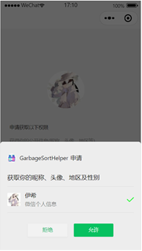
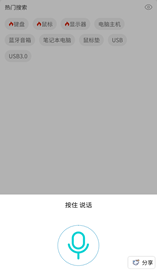
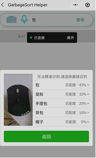
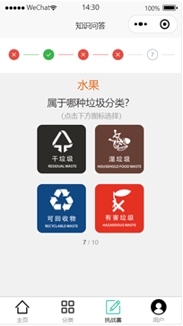

## Introduction
GarbageSortHelper is a WeChat mini-program that simplifies garbage classification for users. It accepts text, images, or voice inputs and utilizes a machine-learning algorithm to assist in the sorting process.

## Skill Stack
Frontend: uni-app(based on vue.js)

Backend: Java(SpringBoot)

Database: Mysql

## Functions Overview

## Login Page

## Voice Search Page

## Image Search Page

## Contest Page

